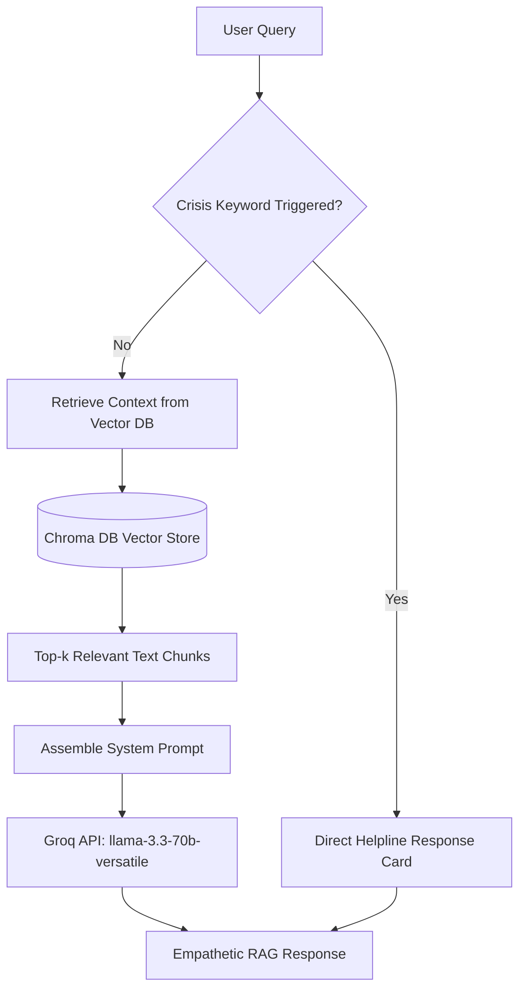

# Patronus AI: RAG Mental Health Chatbot - System Architecture & Developer Documentation

Welcome to the comprehensive system documentation for **Patronus AI**, a full-stack, state-of-the-art mental health support application. The system integrates a robust FastAPI backend, a vector retrieval pipeline using ChromaDB, a relational database layer using SQLite, and a sleek, interactive React dashboard interface built using Vite and TypeScript.

---

## 1. Directory Structure

Below is the directory structure of the application:

```
RAG_Chatbot/
├── backend/                      # Python FastAPI Backend
│   ├── app/                      # Application initialization and core configurations
│   │   ├── __init__.py           # Application Factory, CORS middleware, routing setup
│   │   ├── config.py             # Environment configuration (dotenv + config.json fallbacks)
│   │   ├── constants.py          # Global constants (e.g. crisis hotlines, default variables)
│   │   ├── errors.py             # Custom global error & exception handlers
│   │   └── extensions.py         # SQLAlchemy Base, database engine & session declaration
│   ├── auth/                     # Authentication Module
│   │   ├── __init__.py           # Authentication router init
│   │   ├── models.py             # User SQLAlchemy model
│   │   ├── routes.py             # Login, signup, and me endpoints
│   │   └── utils.py              # Password cryptography (bcrypt) and JWT helpers
│   ├── api/                      # Main Business Logic Routes and Models
│   │   ├── routes/
│   │   │   ├── appointments.py   # Therapist slot booking & scheduling endpoints
│   │   │   ├── chat.py           # User-bot conversation logging & querying endpoint
│   │   │   └── resources.py      # Articles and self-help material directory routes
│   │   └── models/
│   │       ├── appointment.py    # Appointment SQLAlchemy model
│   │       ├── chat.py           # ChatLog SQLAlchemy model
│   │       └── resource.py       # Resource SQLAlchemy model
│   ├── chatbot/                  # LLM Integration and Retrieval Engine
│   │   ├── __init__.py           # Chatbot module exports
│   │   ├── knowledge_base.py    # Document extraction (PDF parser) and Chroma vector setup
│   │   ├── processor.py         # Crisis keyword parsing and request formatting
│   │   ├── rag_engine.py        # LangChain & ChatGroq setup and querying
│   │   └── response.py          # Groq output handling and final responder interfaces
│   ├── services/                 # Integrations for outer API interactions (mocked)
│   │   ├── calendar.py          # Calendar scheduler sync stubs
│   │   ├── email.py             # Automated email confirmation stubs
│   │   └── sms.py               # SMS alerting stubs (Twilio)
│   ├── tasks/                    # Celery / background worker tasks
│   │   └── scheduled.py         # Job loops for therapist appointment reminders
│   ├── config/                   # Configuration presets
│   │   └── config.example.json   # Mock structure for deployment configuration file
│   ├── main.py                   # FastAPI executable uvicorn wrapper
│   ├── streamlit_app.py          # Legacy Streamlit prototype interface
│   └── mental_health.db          # SQLite persistent storage (Local, excluded in Git)
│
├── frontend/                     # React Single Page Application (Vite + TS)
│   ├── src/
│   │   ├── components/           # Sub-divided visual elements
│   │   │   ├── chat/             # ChatInput, ChatMessage, ChatWindow, CrisisCard
│   │   │   ├── common/           # Header, HeroStrip, MoodSelector, Sidebar, TopicChips, ResourceList
│   │   │   ├── auth/             # Login/Signup/MFA forms (AuthForm)
│   │   │   └── appointments/     # Slot booker calendars (BookingForm)
│   │   ├── services/
│   │   │   └── api.ts            # Axios configuration, interceptors, and backend service calls
│   │   ├── App.tsx               # Main component routing state and tab container
│   │   ├── index.css             # Main styling, HSL colors, animations, and transitions
│   │   └── main.tsx              # React client app entrypoint
│   ├── package.json              # Dependency declarations for NPM package builds
│   └── vite.config.ts            # Rolldown build configurations
│
├── data-storage/                 # Vector Store and Raw Corpus Data
│   ├── data/                     # Raw public PDF guidelines (WHO, Govt of India)
│   └── vector_db_dir/            # SQLite metadata for ChromaDB vector embeddings
│
├── config/                       # Host configurations
│   ├── nginx/                    # Reverse-proxy config files
│   └── supervisor/               # Daemonized execution monitoring maps
│
├── docker/                       # Containerization components
│   ├── Dockerfile                # Production builds definition
│   └── docker-compose.yml        # Multi-container orchestration (App, redis, db)
│
├── requirements/                 # Dependency groupings
│   ├── base.txt                  # Minimum required libraries
│   ├── dev.txt                   # Testing and local development tools
│   └── prod.txt                  # WSGI runners and database server driver libs
│
├── scripts/                      # Setup scripts
│   ├── setup.sh                  # Virtual env builder and seed executor
│   ├── deploy.sh                 # Git checkout pull and image re-builder
│   └── backup.sh                 # Database state compressor and cloud exporter
│
├── tests/                        # Backend test suites
│   └── unit/
│       └── test_chatbot.py       # Pytest unit tests checking RAG & safety mechanisms
│
├── .gitignore                    # Environment & credential rules for git index exclusions
├── run.ps1                       # Automated project orchestrator script (PowerShell)
└── README.md                     # Root startup instructions
```

---

## 2. Relational Database Schema (SQLite)

The database layer utilizes **SQLAlchemy ORM** to connect to `backend/mental_health.db` (by default). The database is initialized automatically on startup (`Base.metadata.create_all`).

### Entity Relationship & Tables

#### 1. Users Table (`users`)
Managed under [backend/auth/models.py](file:///d:/Projects%20Foder/RAG_Chatbot/backend/auth/models.py).
* `id` (Integer, Primary Key, Auto-Increment)
* `email` (String, Unique, Index, Nullable=False)
* `password_hash` (String, Nullable=False) - Bcrypt-hashed password.
* `created_at` (DateTime, Default=datetime.utcnow)

#### 2. Appointments Table (`appointments`)
Managed under [backend/api/models/appointment.py](file:///d:/Projects%20Foder/RAG_Chatbot/backend/api/models/appointment.py).
* `id` (Integer, Primary Key, Auto-Increment)
* `user_id` (Integer, Foreign Key `users.id`, Nullable=False)
* `therapist_name` (String, Nullable=False)
* `appointment_date` (String, Nullable=False) - Stored in ISO format.
* `appointment_time` (String, Nullable=False)
* `status` (String, Default="Scheduled") - e.g. "Scheduled", "Cancelled", "Completed".
* `created_at` (DateTime, Default=datetime.utcnow)

#### 3. Resources Table (`resources`)
Managed under [backend/api/models/resource.py](file:///d:/Projects%20Foder/RAG_Chatbot/backend/api/models/resource.py).
* `id` (Integer, Primary Key, Auto-Increment)
* `title` (String, Nullable=False)
* `category` (String, Nullable=False) - e.g., "Anxiety", "Sleep", "General Mental Health".
* `content` (Text, Nullable=False) - Full content/markdown of the article.
* `tags` (String, Nullable=True) - Comma-separated descriptors.
* `created_at` (DateTime, Default=datetime.utcnow)

#### 4. Chat Logs Table (`chat_logs`)
Managed under [backend/api/models/chat.py](file:///d:/Projects%20Foder/RAG_Chatbot/backend/api/models/chat.py).
* `id` (Integer, Primary Key, Auto-Increment)
* `user_id` (Integer, Foreign Key `users.id`, Nullable=True) - Optional for logged-in tracking.
* `message` (Text, Nullable=False) - User input message.
* `response` (Text, Nullable=False) - Chatbot generative response.
* `is_crisis` (Boolean, Default=False) - Flag identifying if self-harm or emergency crisis protocol was triggered.
* `created_at` (DateTime, Default=datetime.utcnow)

---

## 3. RAG Pipeline & Safety Architecture

The AI retrieval system combines a strict safety controller with a document-grounded vector store pipeline.



### Retrieval Mechanics (`backend/chatbot/rag_engine.py` & `knowledge_base.py`)
1. **Document Loading**: Raw mental health manuals from WHO and Ministry of Health are parsed from PDF format using PyPDF2 or PyTesseract.
2. **Text Chunking**: Parsed text is split using LangChain's `RecursiveCharacterTextSplitter` with a chunk size of `2000` characters and a chunk overlap of `500` characters to maintain query context boundaries.
3. **Embeddings**: Employs HuggingFace's open-source `sentence-transformers/all-mpnet-base-v2` embeddings (dimension 768) to map text chunks.
4. **Vector Database**: Chroma DB stores embeddings locally inside `data-storage/vector_db_dir/`. Similarity queries use L2 distance to return the top `3` context matches.

### Safety Protocols (`backend/chatbot/processor.py`)
To prevent the model from hallucinating medical advice or failing to handle emergencies, a parsing layer intercepts messages before LLM invocation:
* **Crisis Keywords**: A set of panic descriptors (such as "suicide", "harm myself", "cutting", "kill myself", "end my life") is checked against the parsed message.
* **Helpline Card**: If a crisis keyword matches, the system circumvents LLM query generation entirely. It returns a static crisis card carrying validated regional and international helpline details (e.g. Vandrevala Foundation, AASRA, AAS, national hotlines) and flags the session log.
* **Boundary Enforcement**: System prompts explicitly command the LLM:
  * Never act as a therapist.
  * Ground all recommendations strictly within the retrieved context documents.
  * Direct the user to licensed medical professionals for diagnoses.

---

## 4. REST API Documentation

FastAPI exposes endpoints structured into three main route domains. JWT verification is conducted using headers containing a valid Bearer token.

### 1. Authentication (`/api/auth`)
* `POST /api/auth/register`: Signup a new user. Accepts `{"email": "...", "password": "..."}`. Returns JWT.
* `POST /api/auth/login`: Login user. Authenticates password hashes using bcrypt. Returns standard JWT token `{"access_token": "...", "token_type": "bearer"}`.
* `GET /api/auth/me`: Verifies active JWT and returns the profile details of the authenticated caller.

### 2. Appointments (`/api/appointments`)
* `GET /api/appointments`: Fetches all appointments registered for the logged-in client.
* `POST /api/appointments`: Schedules a session. Accepts appointment date and time payloads. Sends mock SMS/Email notifications on success.
* `DELETE /api/appointments/{id}`: Cancels an scheduled session.

### 3. Resources Library (`/api/resources`)
* `GET /api/resources`: Fetch self-help articles, optionally filtered by tags or categories.
* `POST /api/resources`: Administrator-level endpoint to seed or update library databases.

### 4. Chat (`/chat`)
* `POST /chat`: Exposes chatbot interactions. Accepts `{"message": "..."}`. Returns `{"response": "...", "is_crisis": boolean}`. Supports an optional `Authorization` header to link the query session logs to the user's relational history record.

---

## 5. Frontend Architecture & Safety UI

The React frontend utilizes a multi-tab SPA pattern:

### Component Structure
* **`components/chat/`**:
  * `ChatWindow.tsx`: Displays scrolling dialog structures. Renders bot outputs, user prompts, and crisis alert modules in real-time.
  * `ChatMessage.tsx`: Segregates user styles from bot responses.
  * `CrisisCard.tsx`: Highlights red emergency warning icons and dialable helpline hotlines.
* **`components/common/`**:
  * `Sidebar.tsx`: Navigation bar allowing tabs selection (Chat, Library, Booking, Profile).
  * `HeroStrip.tsx` & `MoodSelector.tsx`: Quick interactive visual indicators for a premium user introduction experience.
* **`components/auth/`**:
  * `AuthForm.tsx`: Handles register, sign-in interfaces, and session storage.
* **`components/appointments/`**:
  * `BookingForm.tsx`: Grid picker allowing quick slot bookings and cancellation actions.

### XSS Prevention
In [frontend/src/components/chat/ChatMessage.tsx](file:///d:/Projects%20Foder/RAG_Chatbot/frontend/src/components/chat/ChatMessage.tsx), markdown output is parsed to HTML for formatting. To protect users against Cross-Site Scripting (XSS), the code implements a strict pre-escape routine on bot and user payloads before rendering using `dangerouslySetInnerHTML`.

---

## 6. Execution & Setup Instructions

### Prerequisites
* Python 3.13 or 3.14
* Node.js v18+ & NPM

### Setup Environment
1. Clone the repository and navigate to the project directory.
2. Initialize virtual environment and install requirements:
   ```bash
   python -m venv .venv
   .venv\Scripts\activate
   pip install -r requirements/base.txt
   ```
3. Set up environment variables inside `.env` at the root directory:
   ```env
   GROQ_API_KEY=your_groq_api_key_here
   DATABASE_URL=sqlite:///backend/mental_health.db
   JWT_SECRET_KEY=generate_a_secure_random_key_here
   ```
4. Install frontend dependencies:
   ```bash
   cd frontend
   npm install
   ```

### Running Locally
To launch both servers simultaneously with hot-reloading:
Use the PowerShell script provided in the root directory:
```powershell
./run.ps1
```
*(Alternatively, run backend in terminal one: `python -m uvicorn backend.main:app --port 8000 --reload` and frontend in terminal two: `cd frontend` -> `npm run dev`).*

### Running Tests
To run unit and RAG testing checks, execute:
```bash
pytest
```
